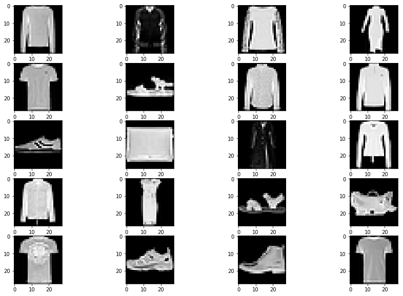
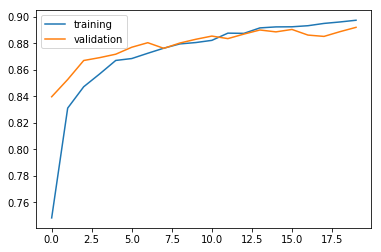
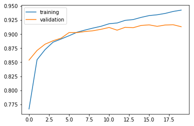
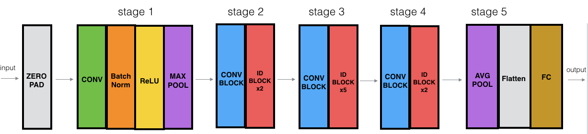
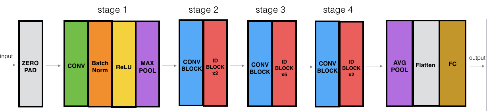

# TD4 - Phân loại trang phục với CNN

TD này lấy từ course "Convolutional Neural Networks" (coursera)

## Phần 1 - Implement CNN

Trong phần này ta implement các phép convolution và pooling với numpy.

Nhắc lại rằng một mô hình CNN có thể được mô tả dưới dạng như sau:

</img>

Trong TD này ta sẽ sử dụng kí hiệu như trong hình vẽ: $Z^{(l-1)}$ cho output ở tầng $(l-1)$ tức input của tầng $l$, $B^{(l)}$ là kết quả của phép convolution, $A^{(l)}$ là kết quả của activation, $Z^{(l)}$ là kết quả của pooling tức output của tầng $l$.

Các thư viện `numpy` và `matplotlib` sẽ được sử dụng trong TD.


```python
import numpy as np
import matplotlib.pyplot as plt
%matplotlib inline
np.random.seed(0)
```

### Bài 1. Zero-padding

***Hãy viết hàm `zeroPadding(X, padding)` nhận đối số `X` là một numpy array có dimension ($m$, $n_H$, $n_W$, $n_C$) (mô tả $m$ hình ảnh có $n_H$ hàng, $n_W$ cột và $n_C$ kênh, một số nguyên dương `padding`; thực hiện thêm `padding` hàng/cột gồm các số 0 ở trên, dưới, trái, phải của mỗi hình ảnh, rồi trả lại output là numpy array đã thay đổi. Lúc này, output có số chiều ($m$, $n_H+2$padding, $n_W + 2$padding, $n_C$).***

Hàm <a href="https://docs.scipy.org/doc/numpy/reference/generated/numpy.pad.html">np.pad</a> có thể giúp bạn


```python
def zeroPadding(Z, padding):
    """
        YOUR CODE HERE
    """
    return 
```

Đoạn code của bạn cần chạy đúng test sau.


```python
#TEST
np.random.seed(0)
Z = np.random.randn(4, 2, 2, 3)
print("First image, first channel: ")
print(Z[0,:,:,0]) #In hình vẽ ứng với dữ liệu thứ nhất, channel (kênh) thứ nhất
print("After transformation: ")
print(zeroPadding(Z, 2)[0,:,:,0])
```

    First image, first channel: 
    [[1.76405235 2.2408932 ]
     [0.95008842 0.4105985 ]]
    After transformation: 
    [[0.         0.         0.         0.         0.         0.        ]
     [0.         0.         0.         0.         0.         0.        ]
     [0.         0.         1.76405235 2.2408932  0.         0.        ]
     [0.         0.         0.95008842 0.4105985  0.         0.        ]
     [0.         0.         0.         0.         0.         0.        ]
     [0.         0.         0.         0.         0.         0.        ]]
    

### Bài 2. Convolution tại 1 vị trí

Giả sử ta cần thực hiện convolution của 1 hình $\mathcal H = n_H \times n_W \times n_C$ với một kernel $f \times f \times n_C$. Bài toán sẽ được quy về việc tính convolution tại từng vị trí của hình $\mathcal H$. Chẳng hạn, đầu tiên, ta trích ra hình chữ nhật con $\mathcal H_{0,0} = [0:f, 0:f]$ rồi tính convolution của nó với kernel, sau đó trích $\mathcal H_{1,0}=[1:f+1, 0:f]$ và tính convolution thứ hai, ... 

Ta sẽ viết một hàm phụ tính convolution của 2 hình chữ nhật kích thước $n_W \times n_W \times n_C$.

***Hãy viết hàm `localConv(Z_local, W, b)` nhận đối số `Z_local`, `W` là 2 numpy array có dimension $(n_H, n_W, n_C)$, `b` là một số thực nhưng biểu diễn dưới dạng 1 numpy array có dimension (1,1,1) (để dễ sử dụng ở các bài sau); tính convolution giữa `Z_local`, `W` rồi cộng kết quả với giá trị của `b`; trả output dưới dạng một số thực (`float`).***


```python
def localConv(Z_local, W, b):
    """
        YOUR CODE HERE
    """
    return
```

Đoạn code của bạn cần chạy đúng test sau.


```python
#TEST
np.random.seed(0)
Z_local = np.random.randn(5, 5, 3)
W = np.random.randn(5, 5, 3)
b = np.random.randn(1, 1, 1)
print(localConv(Z_local, W, b))
```

    -4.685258049390391
    

### Bài 3. Convolution hoàn chỉnh

Nhắc lại rằng trong convolution hoàn chỉnh, ta dùng input ($m \times n_H \times n_W \times n_C$) là một hình $\mathcal H$ ($n_H\times n_W\times n_C$), $n_K$ kernel $W$ ($f \times f \times n_C$), một bias $b$, các tham số `stride`, `padding`. Khi đó output có kích thước $m \times n_H^{new} \times n_W^{new} \times n_K$, trong đó:

$$
n_H^{new} = \lfloor \frac{n_H - f + 2padding}{stride}\rfloor + 1
$$
$$
n_W^{new} = \lfloor \frac{n_W - f + 2padding}{stride}\rfloor + 1
$$

***Hãy viết hàm `conv(Z, W, b, stride=1, padding=0)` nhận đối số:***
- *** `Z`: numpy array ($m \times n_H \times n_W \times n_C$)***
- *** `W`: numpy array ($f \times f \times n_C \times n_K$)***
- *** `b`: numpy array ($1 \times 1 \times n_K$)***
- *** `stride`, `padding`: số nguyên dương (`int`)***

***thực hiện convolution giữa `Z` với `W`, cộng bias `b`, với padding `padding` và stride `stride`. Trả lại : ***

- *** Kết quả của phép convolution (numpy array $m \times n_H^{new} \times n_W^{new} \times n_K $)***


```python
def conv(Z, W, b, stride = 1, padding = 0):
    """
        YOUR CODE HERE
    """
    
    return
```


```python
#TEST
np.random.seed(0)
Z = np.random.randn(10,5,5,3)
W = np.random.randn(2,2,3,8)
b = np.random.randn(1,1,1,8)
padding = 2
stride = 2

Z_new = conv(Z, W, b, padding, stride)
Z_new[3,2,1]
```


    array([ 1.89989437,  3.62683935,  2.34501668,  4.5802782 ,  1.00140585,
           -1.6291433 , -3.93162847,  1.21626912])


## Phần 2. Ứng dụng của CNN

### Bài 4. Dataset `fashion_mnist`

*** Sử dụng cùng hàm như với mnist trong `keras`, hãy load dataset `fashion_mnist` và tìm hiểu số dữ liệu, shape của $X, y$ trên các tập train và test. Có bao nhiêu loại quần áo cần phân loại? Thử vẽ hình một số điểm dữ liệu.***


```python
# YOUR CODE HERE

# Ví dụ: Đây là ảnh 25 hình vẽ được chọn ngẫu nhiên từ tập train
```





***Chuyển `y` của tập train (tương tự, tập test) thành `Y_train` (tương tự, `Y test`) ở dạng một array gồm 60000 dòng (tương tự, 10000 dòng), mỗi dòng là một vector có dạng [0, 0, ..., 0, 1, 0, ..., 0].*** 

***Chia tất cả các pixel của `X` ở tập train và tập test cho 255, lưu với tên gọi `X_train`, `X_test`.***


```python
# YOUR CODE HERE
```

**Test bằng các đoạn code sau**.


```python
#TEST
Y_train[:10]
```


    array([[0., 0., 0., 0., 0., 0., 0., 0., 0., 1.],
           [1., 0., 0., 0., 0., 0., 0., 0., 0., 0.],
           [1., 0., 0., 0., 0., 0., 0., 0., 0., 0.],
           [0., 0., 0., 1., 0., 0., 0., 0., 0., 0.],
           [1., 0., 0., 0., 0., 0., 0., 0., 0., 0.],
           [0., 0., 1., 0., 0., 0., 0., 0., 0., 0.],
           [0., 0., 0., 0., 0., 0., 0., 1., 0., 0.],
           [0., 0., 1., 0., 0., 0., 0., 0., 0., 0.],
           [0., 0., 0., 0., 0., 1., 0., 0., 0., 0.],
           [0., 0., 0., 0., 0., 1., 0., 0., 0., 0.]], dtype=float32)


```python
X_train[0,10,:]
```


    array([0.        , 0.        , 0.        , 0.        , 0.        ,
           0.        , 0.        , 0.        , 0.        , 0.        ,
           0.        , 0.        , 0.        , 0.75686275, 0.89411765,
           0.85490196, 0.83529412, 0.77647059, 0.70588235, 0.83137255,
           0.82352941, 0.82745098, 0.83529412, 0.8745098 , 0.8627451 ,
           0.95294118, 0.79215686, 0.        ])


### Bài 5. FNN

Ta xây dựng FNN như sau:

- Input: $None \times 784$
- Layer 1: 128 hidden units
- Activation 1: ReLU
- Regularization 1: Dropout 25%
- Layer 2: 64 hidden units
- Activation 2: ReLU
- Regularization 2: Dropout 25%
- Layer 3: 10 hidden units
- Activation 3: softmax

Hàm loss được sử dụng vẫn là categorical crossentropy.

*** Từ `(X_train, Y_train)`, sử dụng 80% và 20% cho validation, xây dựng mô hình FNN như mô tả trên để học từ dữ liệu và dự đoán trên tập test. Tính accuracy trên tập train và test sau 20 bước. Thay đổi các thuật toán optimization để cải thiện kết quả.***


```python
from keras import Sequential
from keras.datasets import mnist
from keras.layers import Dropout
from keras.layers.core import Dense, Activation, Flatten
from keras.layers.convolutional import MaxPooling2D, Conv2D
from keras.utils import np_utils
from keras.optimizers import SGD, Adam

np.random.seed(0)

BATCH_SIZE = 128
NB_EPOCH = 20
VERBOSE = 2
VALIDATION_SPLIT = 0.2

# YOUR CODE HERE
# Output có thể như dưới đây
```

    _________________________________________________________________
    Layer (type)                 Output Shape              Param #   
    =================================================================
    dense_4 (Dense)              (None, 128)               100480    
    _________________________________________________________________
    activation_1 (Activation)    (None, 128)               0         
    _________________________________________________________________
    dropout_1 (Dropout)          (None, 128)               0         
    _________________________________________________________________
    dense_5 (Dense)              (None, 64)                8256      
    _________________________________________________________________
    activation_2 (Activation)    (None, 64)                0         
    _________________________________________________________________
    dropout_2 (Dropout)          (None, 64)                0         
    _________________________________________________________________
    dense_6 (Dense)              (None, 10)                650       
    _________________________________________________________________
    activation_3 (Activation)    (None, 10)                0         
    =================================================================
    Total params: 109,386
    Trainable params: 109,386
    Non-trainable params: 0
    _________________________________________________________________
    None
    Train on 48000 samples, validate on 12000 samples
    Epoch 1/20
     - 2s - loss: 0.7178 - acc: 0.7483 - val_loss: 0.4369 - val_acc: 0.8397
    Epoch 2/20
     - 1s - loss: 0.4741 - acc: 0.8311 - val_loss: 0.4066 - val_acc: 0.8527
    Epoch 3/20
     - 2s - loss: 0.4245 - acc: 0.8472 - val_loss: 0.3635 - val_acc: 0.8670
    Epoch 4/20
     - 1s - loss: 0.4024 - acc: 0.8569 - val_loss: 0.3579 - val_acc: 0.8692
    Epoch 5/20
     - 2s - loss: 0.3716 - acc: 0.8670 - val_loss: 0.3532 - val_acc: 0.8717
    Epoch 6/20
     - 1s - loss: 0.3610 - acc: 0.8685 - val_loss: 0.3413 - val_acc: 0.8770
    Epoch 7/20
     - 1s - loss: 0.3501 - acc: 0.8725 - val_loss: 0.3298 - val_acc: 0.8804
    Epoch 8/20
     - 1s - loss: 0.3377 - acc: 0.8763 - val_loss: 0.3338 - val_acc: 0.8762
    Epoch 9/20
     - 2s - loss: 0.3315 - acc: 0.8795 - val_loss: 0.3298 - val_acc: 0.8802
    Epoch 10/20
     - 1s - loss: 0.3255 - acc: 0.8805 - val_loss: 0.3251 - val_acc: 0.8830
    Epoch 11/20
     - 2s - loss: 0.3180 - acc: 0.8822 - val_loss: 0.3206 - val_acc: 0.8854
    Epoch 12/20
     - 1s - loss: 0.3072 - acc: 0.8876 - val_loss: 0.3224 - val_acc: 0.8835
    Epoch 13/20
     - 1s - loss: 0.3035 - acc: 0.8875 - val_loss: 0.3162 - val_acc: 0.8869
    Epoch 14/20
     - 1s - loss: 0.2973 - acc: 0.8916 - val_loss: 0.3094 - val_acc: 0.8900
    Epoch 15/20
     - 1s - loss: 0.2912 - acc: 0.8923 - val_loss: 0.3078 - val_acc: 0.8886
    Epoch 16/20
     - 1s - loss: 0.2893 - acc: 0.8924 - val_loss: 0.3057 - val_acc: 0.8904
    Epoch 17/20
     - 2s - loss: 0.2858 - acc: 0.8932 - val_loss: 0.3126 - val_acc: 0.8862
    Epoch 18/20
     - 1s - loss: 0.2806 - acc: 0.8950 - val_loss: 0.3178 - val_acc: 0.8852
    Epoch 19/20
     - 2s - loss: 0.2788 - acc: 0.8961 - val_loss: 0.3124 - val_acc: 0.8887
    Epoch 20/20
     - 1s - loss: 0.2753 - acc: 0.8974 - val_loss: 0.3043 - val_acc: 0.8920
    


```python
# TEST

train_score = model1.evaluate(X_train_flatten, Y_train)
test_score = model1.evaluate(X_test_flatten, Y_test)
print("Score on training set:", train_score)
print("Score on test set:", test_score)

plt.plot(range(20), history1.history.get('acc'), label='training')
plt.plot(range(20), history1.history.get('val_acc'), label='validation')
plt.legend()
```

    60000/60000 [==============================] - 1s 19us/step
    10000/10000 [==============================] - 0s 16us/step
    Score on training set: [0.23286568358341853, 0.9141833333333333]
    Score on test set: [0.33079483782052993, 0.8849]
    


    <matplotlib.legend.Legend at 0x2a796319438>





### Bài 6. CNN

Ta xây dựng mô hình FNN như sau:

- Input: $None \times 28 \times 28 \times 1$
- Layer 1:
 - Convolution 1: 16 kernel $3 \times 3 \times 1$, padding valid, dùng bias
 - Activation 1: ReLU
 - Max Pooling 1: pool size 2, stride 2
- Layer 2:
 - Convolution 2: 64 kernel $2 \times 2 \times 16$, padding valid, dùng bias
 - Activation 2: ReLU
 - Max Pooling 2: pool size 2, stride 2
- Layer 3:
 - Dense Layer with 64 hidden units
 - Activation: ReLU
- Layer 4:
 - Dense Layer with 10 hidden units
 - Activation: softmax
- Output: 10 units

Hàm loss được sử dụng vẫn là categorical crossentropy.

*** Từ `(X_train, Y_train)`, sử dụng 80% và 20% cho validation, xây dựng mô hình FNN như mô tả trên để học từ dữ liệu và dự đoán trên tập test. Tính accuracy trên tập train và test sau 20 bước. Thay đổi các thuật toán optimization để cải thiện kết quả.***


```python
# YOUR CODE HERE
```

    _________________________________________________________________
    Layer (type)                 Output Shape              Param #   
    =================================================================
    conv2d_1 (Conv2D)            (None, 26, 26, 16)        160       
    _________________________________________________________________
    activation_4 (Activation)    (None, 26, 26, 16)        0         
    _________________________________________________________________
    max_pooling2d_1 (MaxPooling2 (None, 13, 13, 16)        0         
    _________________________________________________________________
    conv2d_2 (Conv2D)            (None, 12, 12, 64)        4160      
    _________________________________________________________________
    activation_5 (Activation)    (None, 12, 12, 64)        0         
    _________________________________________________________________
    max_pooling2d_2 (MaxPooling2 (None, 6, 6, 64)          0         
    _________________________________________________________________
    flatten_1 (Flatten)          (None, 2304)              0         
    _________________________________________________________________
    dense_7 (Dense)              (None, 64)                147520    
    _________________________________________________________________
    activation_6 (Activation)    (None, 64)                0         
    _________________________________________________________________
    dropout_3 (Dropout)          (None, 64)                0         
    _________________________________________________________________
    dense_8 (Dense)              (None, 10)                650       
    _________________________________________________________________
    activation_7 (Activation)    (None, 10)                0         
    =================================================================
    Total params: 152,490
    Trainable params: 152,490
    Non-trainable params: 0
    _________________________________________________________________
    None
    Train on 48000 samples, validate on 12000 samples
    Epoch 1/20
     - 26s - loss: 0.6585 - acc: 0.7670 - val_loss: 0.4099 - val_acc: 0.8538
    Epoch 2/20
     - 26s - loss: 0.4110 - acc: 0.8545 - val_loss: 0.3597 - val_acc: 0.8709
    Epoch 3/20
     - 29s - loss: 0.3585 - acc: 0.8724 - val_loss: 0.3196 - val_acc: 0.8821
    Epoch 4/20
     - 29s - loss: 0.3253 - acc: 0.8857 - val_loss: 0.3009 - val_acc: 0.8882
    Epoch 5/20
     - 26s - loss: 0.2994 - acc: 0.8913 - val_loss: 0.2970 - val_acc: 0.8928
    Epoch 6/20
     - 26s - loss: 0.2836 - acc: 0.8971 - val_loss: 0.2675 - val_acc: 0.9028
    Epoch 7/20
     - 24s - loss: 0.2655 - acc: 0.9034 - val_loss: 0.2626 - val_acc: 0.9028
    Epoch 8/20
     - 25s - loss: 0.2562 - acc: 0.9072 - val_loss: 0.2565 - val_acc: 0.9046
    Epoch 9/20
     - 30s - loss: 0.2468 - acc: 0.9108 - val_loss: 0.2518 - val_acc: 0.9060
    Epoch 10/20
     - 23s - loss: 0.2351 - acc: 0.9139 - val_loss: 0.2519 - val_acc: 0.9086
    Epoch 11/20
     - 24s - loss: 0.2243 - acc: 0.9184 - val_loss: 0.2470 - val_acc: 0.9118
    Epoch 12/20
     - 24s - loss: 0.2163 - acc: 0.9198 - val_loss: 0.2552 - val_acc: 0.9070
    Epoch 13/20
     - 24s - loss: 0.2071 - acc: 0.9244 - val_loss: 0.2479 - val_acc: 0.9121
    Epoch 14/20
     - 24s - loss: 0.2000 - acc: 0.9258 - val_loss: 0.2494 - val_acc: 0.9114
    Epoch 15/20
     - 24s - loss: 0.1904 - acc: 0.9298 - val_loss: 0.2393 - val_acc: 0.9154
    Epoch 16/20
     - 24s - loss: 0.1838 - acc: 0.9329 - val_loss: 0.2372 - val_acc: 0.9164
    Epoch 17/20
     - 24s - loss: 0.1764 - acc: 0.9344 - val_loss: 0.2460 - val_acc: 0.9138
    Epoch 18/20
     - 24s - loss: 0.1694 - acc: 0.9368 - val_loss: 0.2385 - val_acc: 0.9162
    Epoch 19/20
     - 25s - loss: 0.1610 - acc: 0.9403 - val_loss: 0.2391 - val_acc: 0.9167
    Epoch 20/20
     - 24s - loss: 0.1557 - acc: 0.9426 - val_loss: 0.2467 - val_acc: 0.9132
    


```python
# TEST

train_score = model2.evaluate(X_train_3D, Y_train)
test_score = model2.evaluate(X_test_3D, Y_test)
print("Score on training set:", train_score[1])
print("Score on test set:", test_score[1])

plt.plot(range(20), history2.history.get('acc'), label='training')
plt.plot(range(20), history2.history.get('val_acc'), label='validation')
plt.legend()
```

    60000/60000 [==============================] - 12s 198us/step
    10000/10000 [==============================] - 2s 182us/step
    Score on training set: 0.9497
    Score on test set: 0.9122
    


    <matplotlib.legend.Legend at 0x2a796345780>





### Bài 7 (Optional) Implement với `Tensorflow`

***Implement mô hình ở bài 6 với `tensorflow` thay vì `keras`.***

Tham khảo course *Convolutional Neural Network*, week 1, notebook 2.


```python
import tensorflow as tf
from tensorflow.python.framework import ops

ops.reset_default_graph()
tf.set_random_seed(1)  

# X, Y tức tensor input và output được định nghĩa ở dạng placeholder
X = tf.placeholder(tf.float32, shape = (None, X_train.shape[1], X_train.shape[2], 1))
Y = tf.placeholder(tf.float32, shape = (None, 10))

# Kernel W1 có kích thước 3x3, 16 kernels, 1 channel, được định nghĩa và khởi tạo như sau
W1 = tf.get_variable("W1", [3, 3, 1, 16], initializer = tf.contrib.layers.xavier_initializer(seed = 0))

# Kernel W2 có kích thước 2x2, 16 channels, 64 kernels
W2 = tf.get_variable("W2", [2, 2, 16, 64], initializer = tf.contrib.layers.xavier_initializer(seed = 0))

# Xây dựng mô hình
# CONV2D 1
Z1 = tf.nn.conv2d(X, W1, strides = [1,1,1,1], padding = 'VALID')
    
# RELU 1
A1 = tf.nn.relu(Z1)
    
# MAXPOOL 1
P1 = tf.nn.max_pool(A1, ksize = [1,2,2,1], strides = [1,2,2,1], padding = 'VALID')
    
# CONV2D 2
Z2 = tf.nn.conv2d(P1, W2, strides = [1,1,1,1], padding = 'VALID')

# RELU 2
A2 = tf.nn.relu(Z2)

# MAXPOOL: window 4x4, stride 4, padding 'SAME'
P2 = tf.nn.max_pool(A2, ksize = [1,2,2,1], strides = [1,2,2,1], padding = 'VALID')

# FLATTEN
PF2 = tf.contrib.layers.flatten(P2)

# FULLY-CONNECTED     
Z3 = tf.contrib.layers.fully_connected(PF2, 10)

# Calculate cost
cost = tf.reduce_mean(tf.nn.softmax_cross_entropy_with_logits(logits = Z3, labels = Y))

# Optimizer
optimizer = tf.train.AdamOptimizer().minimize(cost)
    
# Initialize all the variables globally
init = tf.global_variables_initializer()
```

    WARNING:tensorflow:From <ipython-input-21-16e92a52588c>:43: softmax_cross_entropy_with_logits (from tensorflow.python.ops.nn_ops) is deprecated and will be removed in a future version.
    Instructions for updating:
    
    Future major versions of TensorFlow will allow gradients to flow
    into the labels input on backprop by default.
    
    See @{tf.nn.softmax_cross_entropy_with_logits_v2}.
    
    


```python
# Code from coursera course
import math

def random_mini_batches(X, Y, mini_batch_size = 64, seed = 0):
    """
    Creates a list of random minibatches from (X, Y)
    
    Arguments:
    X -- input data, of shape (input size, number of examples) (m, Hi, Wi, Ci)
    Y -- true "label" vector (containing 0 if cat, 1 if non-cat), of shape (1, number of examples) (m, n_y)
    mini_batch_size - size of the mini-batches, integer
    seed -- this is only for the purpose of grading, so that you're "random minibatches are the same as ours.
    
    Returns:
    mini_batches -- list of synchronous (mini_batch_X, mini_batch_Y)
    """
    
    m = X.shape[0]                  # number of training examples
    mini_batches = []
    np.random.seed(seed)
    
    # Step 1: Shuffle (X, Y)
    permutation = list(np.random.permutation(m))
    shuffled_X = X[permutation,:,:,:]
    shuffled_Y = Y[permutation,:]

    # Step 2: Partition (shuffled_X, shuffled_Y). Minus the end case.
    num_complete_minibatches = math.floor(m/mini_batch_size) # number of mini batches of size mini_batch_size in your partitionning
    for k in range(0, num_complete_minibatches):
        mini_batch_X = shuffled_X[k * mini_batch_size : k * mini_batch_size + mini_batch_size,:,:,:]
        mini_batch_Y = shuffled_Y[k * mini_batch_size : k * mini_batch_size + mini_batch_size,:]
        mini_batch = (mini_batch_X, mini_batch_Y)
        mini_batches.append(mini_batch)
    
    # Handling the end case (last mini-batch < mini_batch_size)
    if m % mini_batch_size != 0:
        mini_batch_X = shuffled_X[num_complete_minibatches * mini_batch_size : m,:,:,:]
        mini_batch_Y = shuffled_Y[num_complete_minibatches * mini_batch_size : m,:]
        mini_batch = (mini_batch_X, mini_batch_Y)
        mini_batches.append(mini_batch)
    
    return mini_batches

with tf.Session() as sess:
    cost_history = []
    seed = 0
    
    # Run the initialization
    sess.run(init)
        
    # Do the training loop
    for epoch in range(NB_EPOCH):

        minibatch_cost = 0.
        num_minibatches = int(X_train.shape[0] / BATCH_SIZE) # number of minibatches of size minibatch_size in the train set
        seed = seed + 1
        minibatches = random_mini_batches(X_train_3D, Y_train, BATCH_SIZE, seed)

        for minibatch in minibatches:

            # Select a minibatch
            (minibatch_X, minibatch_Y) = minibatch
            # IMPORTANT: The line that runs the graph on a minibatch.
            # Run the session to execute the optimizer and the cost, the feedict should contain a minibatch for (X,Y).
            ### START CODE HERE ### (1 line)
            _ , temp_cost = sess.run([optimizer, cost], feed_dict={X: minibatch_X, Y: minibatch_Y})
            ### END CODE HERE ###
                
            minibatch_cost += temp_cost / num_minibatches
                

        # Print the cost every epoch
        if epoch % 5 == 0:
            print ("Cost after epoch %i: %f" % (epoch, minibatch_cost))
        
        cost_history.append(minibatch_cost)
        
        
    # plot the cost
    plt.plot(np.squeeze(cost_history))
    plt.ylabel('cost')
    plt.xlabel('iterations (per tens)')
    plt.show()

    # Calculate the correct predictions
    predict_op = tf.argmax(Z3, 1)
    correct_prediction = tf.equal(predict_op, tf.argmax(Y, 1))
        
    # Calculate accuracy on the test set
    accuracy = tf.reduce_mean(tf.cast(correct_prediction, "float"))
    print(accuracy)
    train_accuracy = accuracy.eval({X: X_train_3D, Y: Y_train})
    test_accuracy = accuracy.eval({X: X_test_3D, Y: Y_test})
    print("Train Accuracy:", train_accuracy)
    print("Test Accuracy:", test_accuracy)
```

    Cost after epoch 0: 1.434086
    Cost after epoch 5: 0.962455
    Cost after epoch 10: 0.921783
    Cost after epoch 15: 0.895099
    


    Tensor("Mean_1:0", shape=(), dtype=float32)
    Train Accuracy: 0.6587833
    Test Accuracy: 0.6395
    

# Phần 3. Deep ResNet

Ta sẽ implement một mô hình sâu hơn 50 tầng như mô tả dưới đây, lấy từ course [1] và giảm đi 1 tầng để phù hợp input bài toán

</img>

Trong đó các block ZERO PAD, CONV, BatchNorm, ReLU, MAX POOL, AVG POOL, Flatten, FC là các phép biến đổi đã học, phần tham số sẽ được mô tả sau. Các block CONV BLOCK và ID BLOCK là một chuỗi các phép biến đổi (layer) nối liền nhau. Ta sẽ bắt đầu với việc implement các block này.

### Bài 8. Identity Block

</img>

Mỗi identity block (ID BLOCK trong hình trước) được cấu tạo từ output của 1 tầng $(l)$, sau đó:
- Tầng $(l+1)$
 - Conv2D với $F_1$ kernels có kích thước $(1, 1)$, stride $(1, 1)$, padding valid. Để thuận tiện mô tả về sau, ta đặt tên tầng này là `"conv1_" + str(stage) + "_" + str(block)` trong đó `stage` là số thứ tự stage, `block` là số thứ tự block 
 - BatchNorm để chuẩn hóa chiều tương ứng với channel. Tầng này có tên `"bn1_" + str(stage) + "_" + str(block)`
 - Activation với ReLU. Tầng này không có tên.
- Tầng $(l+2)$
 - Conv2D với $F_2$ kernels có kích thước $(f, f)$, stride $(1, 1)$, padding same. Tầng này có tên `"conv2_" + str(stage) + "_" + str(block)`
 - BatchNorm để chuẩn hóa chiều tương ứng với channel. Tầng này có tên `"bn2_" + str(stage) + "_" + str(block)`
 - Activation với ReLU
- Tầng $(l+3)$
 - Conv2D với $F_3$ kernels có kích thước $(1, 1)$, stride $(1, 1)$, padding valid. Tầng này có tên `"conv3_" + str(stage) + "_" + str(block)`
 - BatchNorm để chuẩn hóa chiều tương ứng với channel. Tầng này có tên `"bn3_" + str(stage) + "_" + str(block)`
- Tổng hợp
 - Cộng output sau khi BatchNorm ở tầng $(l+3)$ với output sau tầng $(l)$
 - Activation với ReLU
 
***Hoàn thành hàm `identityBlock(X, f, filters, stage, block)` implement identity block như mô tả trên. Hàm này nhận đối số `X` là một tensor (numpy array) $None \times n_H \times n_W \times n_C$, `f` là một số nguyên dương mô tả kích thước kernel (mặc định kernel là 1 hình vuông), `filters` là list $[F_1, F_2, F_3]$ như mô tả trên.***


```python
import tensorflow as tf
from keras.initializers import glorot_uniform
from keras.layers import Input, Add, Dense, Activation, ZeroPadding2D, BatchNormalization, Flatten, Conv2D, AveragePooling2D, MaxPooling2D, GlobalMaxPooling2D

import keras.backend as K
K.set_image_data_format('channels_last')
K.set_learning_phase(1)
```


```python
def identityBlock(X, f, filters, stage, block):
    """
    Implementation of the identity block as defined in Figure 3
    
    Arguments:
    X -- input tensor of shape (m, n_H_prev, n_W_prev, n_C_prev)
    f -- integer, specifying the shape of the middle CONV's window for the main path
    filters -- python list of integers, defining the number of filters in the CONV layers of the main path
    stage -- integer, used to name the layers, depending on their position in the network
    block -- string/character, used to name the layers, depending on their position in the network
    
    Returns:
    X -- output of the identity block, tensor of shape (n_H, n_W, n_C)
    """
    
    # Retrieve Filters
    F1, F2, F3 = filters
    
    # Save the input value. You'll need this later to add back to the main path. 
    X_shortcut = X
    
    # First component of main path
    X = Conv2D(filters = F1, kernel_size = (1, 1), strides = (1,1), padding = 'valid', name = "conv1_" + str(stage) + "_" + str(block), kernel_initializer = glorot_uniform(seed=0))(X)
    X = BatchNormalization(axis = 3, name = "bn1_" + str(stage) + "_" + str(block))(X)
    X = Activation('relu')(X)
    
    ### YOUR CODE HERE ###
    
    # Second component of main path (≈3 lines)
    X = None
    X = None
    X = None

    # Third component of main path (≈2 lines)
    X = None
    X = None

    # Final step: Add shortcut value to main path, and pass it through a RELU activation (≈2 lines)
    X = None
    X = None
    
    ### END CODE HERE ###
    
    return X
```

Đoạn sau giúp test hàm của bạn


```python
# TEST

tf.reset_default_graph()

with tf.Session() as test:
    np.random.seed(1)
    A_prev = tf.placeholder("float", [3, 4, 4, 6])
    X = np.random.randn(3, 4, 4, 6)
    A = identityBlock(A_prev, f = 2, filters = [2, 4, 6], stage = 0, block = 0)
    test.run(tf.global_variables_initializer())
    out = test.run([A], feed_dict={A_prev: X, K.learning_phase(): 0})
    print("out = " + str(out[0][1][1][0]))
```

    out = [0.19716813 0.         1.3561227  2.1713073  0.         1.3324987 ]
    

### Bài 9. Convolutional Block

Ta cần implement mô hình sau:

</img>

Trong đó:

Mỗi convolutional block (CONV BLOCK trong hình trước) được cấu tạo từ output của 1 tầng $(l)$ theo 2 nhánh:

**Nhánh 1**
- Tầng $(l+1)$
 - Conv2D với $F_1$ kernels có kích thước $(1, 1)$, stride $(s, s)$, padding valid. Tầng này có tên `"conv1_" + str(stage) + "_" + str(block)`
 - BatchNorm để chuẩn hóa chiều tương ứng với channel. Tầng này có tên `"bn1_" + str(stage) + "_" + str(block)`
 - Activation với ReLU
- Tầng $(l+2)$
 - Conv2D với $F_2$ kernels có kích thước $(f, f)$, stride $(1, 1)$, padding same. Tầng này có tên `"conv2_" + str(stage) + "_" + str(block)`
 - BatchNorm để chuẩn hóa chiều tương ứng với channel. Tầng này có tên `"bn2_" + str(stage) + "_" + str(block)`
 - Activation với ReLU
- Tầng $(l+3)$
 - Conv2D với $F_3$ kernels có kích thước $(1, 1)$, stride $(1, 1)$, padding valid. Tầng này có tên `"conv3_" + str(stage) + "_" + str(block)`
 - BatchNorm để chuẩn hóa chiều tương ứng với channel. Tầng này có tên `"bn3_" + str(stage) + "_" + str(block)`
 
**Nhánh 2**
- Tầng phụ $(l+3)$
 - Conv2D với $F_3$ kernels có kích thước $(1, 1)$, stride $(s, s)$, padding valid. Tầng này có tên `"conv4_" + str(stage) + "_" + str(block)`
 - BatchNorm để chuẩn hóa chiều tương ứng với channel. Tầng này có tên `"bn4_" + str(stage) + "_" + str(block)`

**Tổng hợp**
 - Cộng output nhánh 1 và 2
 - Activation với ReLU

***Hoàn thành hàm `convolutionalBlock(X, f, filters, stage, block, s=2)` implement convolutional block như mô tả trên. Hàm này nhận đối số `X` là một tensor (numpy array) $None \times n_H \times n_W \times n_C$, `f` là một số nguyên dương mô tả kích thước kernel (mặc định kernel là 1 hình vuông), `filters` là list $[F_1, F_2, F_3]$ như mô tả trên, `s` là stride khác 1 được kí hiệu là $s$ trong mô tả trên.***


```python
def convolutionalBlock(X, f, filters, stage, block, s=2):
    """
    Implementation of the convolutional block as defined above
    
    Arguments:
    X -- input tensor of shape (m, n_H_prev, n_W_prev, n_C_prev)
    f -- integer, specifying the shape of the middle CONV's window for the main path
    filters -- python list of integers, defining the number of filters in the CONV layers of the main path
    stage -- integer, used to name the layers, depending on their position in the network
    block -- string/character, used to name the layers, depending on their position in the network
    s -- Integer, specifying the stride to be used
    
    Returns:
    X -- output of the convolutional block, tensor of shape (n_H, n_W, n_C)
    """
    
    # Retrieve Filters
    F1, F2, F3 = filters
    
    # Save the input value
    X_shortcut = X


    ##### MAIN PATH #####
    # First component of main path 
    X = Conv2D(F1, (1, 1), strides = (s,s), name = "conv1_" + str(stage) + "_" + str(block), kernel_initializer = glorot_uniform(seed=0))(X)
    X = BatchNormalization(axis = 3, name = "bn1_" + str(stage) + "_" + str(block))(X)
    X = Activation('relu')(X)
    
    ### YOUR CODE HERE ###

    # Second component of main path (≈3 lines)
    X = None
    X = None
    X = None

    # Third component of main path (≈2 lines)
    X = None
    X = None

    ##### SHORTCUT PATH #### (≈2 lines)
    X_shortcut = None
    X_shortcut = None

    # Final step: Add shortcut value to main path, and pass it through a RELU activation (≈2 lines)
    X = None
    X = None
    
    ### END CODE HERE ###
    
    return X
```

Test bằng đoạn code dưới đây.


```python
# TEST
tf.reset_default_graph()

with tf.Session() as test:
    np.random.seed(1)
    A_prev = tf.placeholder("float", [3, 4, 4, 6])
    X = np.random.randn(3, 4, 4, 6)
    A = convolutionalBlock(A_prev, f = 2, filters = [2, 4, 6], stage = 0, block = 0)
    test.run(tf.global_variables_initializer())
    out = test.run([A], feed_dict={A_prev: X, K.learning_phase(): 0})
    print("out = " + str(out[0][1][1][0]))
```

    out = [0.09018463 1.2348977  0.46822017 0.0367176  0.         0.65516603]
    

### Bài 10. Deep ResNet

Ta xây dựng mô hình như hình đã mô tả
</img>

Input: 28 x 28 x 1

- Zero-padding với $s = (2,2)$

- Stage 1:
    - 64 kernels kích thước (5,5), stride (2,2)
    - BatchNorm ở channel
    - MaxPooling kích thước (3,3), stride (2,2)
    
- Stage 2:
    - Convolutional block với số kernel [512, 512, 2048], $f = 3$, $s = 2$
    - 2 Identity block với số kernel [512, 512, 2048], $f = 3$.

- Stage 3:
    - Convolutional block với số kernel [256, 256, 1024], $f = 3$, $s = 2$
    - 5 Identity block với số kernel [256, 256, 1024], $f = 3$

- Stage 4:
    - Convolutional block với số kernel [512, 512, 2048], $f = 3$, $s = 2$
    - 2 Identity block với số kernel [512, 512, 2048], $f = 3$.

- Average Pooling kích thước (2,2)
- Flatten
- Fully Connected layer với số output unit bằng 10, softmax activation

Output: 10 units

***Hoàn thành hàm `ResNet(input_shape = (28, 28, 1), classes = 10)` implement mô hình trên. Hàm nhận đối số là kích thước input và output, trả lại một instance thuộc class `Model` của `keras`.***


```python
def ResNet(input_shape = (28, 28, 1), classes = 10):
    """
    Implementation of the popular ResNet50 the following architecture:
    CONV2D -> BATCHNORM -> RELU -> MAXPOOL -> CONVBLOCK -> IDBLOCK*2 -> CONVBLOCK -> IDBLOCK*3
    -> CONVBLOCK -> IDBLOCK*5 -> CONVBLOCK -> IDBLOCK*2 -> AVGPOOL -> TOPLAYER

    Arguments:
    input_shape -- shape of the images of the dataset
    classes -- integer, number of classes

    Returns:
    model -- a Model() instance in Keras
    """
    
    # Define the input as a tensor with shape input_shape
    X_input = Input(shape = input_shape, name = "input")

    
    # Zero-Padding
    X = ZeroPadding2D((2, 2))(X_input)
    
    # Stage 1
    X = Conv2D(64, (5, 5), strides = (2, 2), kernel_initializer = glorot_uniform(seed=0), name="conv_initial")(X)
    # YOUR CODE HERE (1)
    X = None
    X = None
    X = None
    # END CODE HERE (1)

    # Stage 2
    X = convolutionalBlock(X, f = 3, filters = [64, 64, 256], s = 1, stage = 2, block = 1)
    X = identityBlock(X, 3, [64, 64, 256], stage = 2, block = 2)
    # YOUR CODE HERE (2)
    X = None

    # Stage 3 (≈6 lines)
    X = None
    X = None
    X = None
    X = None
    X = None
    X = None

    # Stage 4 (≈3 lines)
    X = None
    X = None
    X = None
    
    # AVGPOOL (≈1 line). Use "X = AveragePooling2D(...)(X)"
    X = None
    # END CODE HERE (2)

    # output layer
    X = Flatten()(X)
    X = Dense(classes, activation='softmax', kernel_initializer = glorot_uniform(seed=0), name="dense_target")(X)
    
    
    # Create model
    model = Model(inputs = X_input, outputs = X, name='ResNet')

    return model
```


```python
# TEST
model3 = ResNet(input_shape = (28, 28, 1), classes = 10)
model3.summary()
```

    __________________________________________________________________________________________________
    Layer (type)                    Output Shape         Param #     Connected to                     
    ==================================================================================================
    input (InputLayer)              (None, 28, 28, 1)    0                                            
    __________________________________________________________________________________________________
    zero_padding2d_3 (ZeroPadding2D (None, 32, 32, 1)    0           input[0][0]                      
    __________________________________________________________________________________________________
    conv_initial (Conv2D)           (None, 14, 14, 64)   1664        zero_padding2d_3[0][0]           
    __________________________________________________________________________________________________
    bn_initial (BatchNormalization) (None, 14, 14, 64)   256         conv_initial[0][0]               
    __________________________________________________________________________________________________
    activation_41 (Activation)      (None, 14, 14, 64)   0           bn_initial[0][0]                 
    __________________________________________________________________________________________________
    pool_initial (MaxPooling2D)     (None, 6, 6, 64)     0           activation_41[0][0]              
    __________________________________________________________________________________________________
    conv1_2_1 (Conv2D)              (None, 6, 6, 64)     4160        pool_initial[0][0]               
    __________________________________________________________________________________________________
    bn1_2_1 (BatchNormalization)    (None, 6, 6, 64)     256         conv1_2_1[0][0]                  
    __________________________________________________________________________________________________
    activation_42 (Activation)      (None, 6, 6, 64)     0           bn1_2_1[0][0]                    
    __________________________________________________________________________________________________
    conv2_2_1 (Conv2D)              (None, 6, 6, 64)     36928       activation_42[0][0]              
    __________________________________________________________________________________________________
    bn2_2_1 (BatchNormalization)    (None, 6, 6, 64)     256         conv2_2_1[0][0]                  
    __________________________________________________________________________________________________
    activation_43 (Activation)      (None, 6, 6, 64)     0           bn2_2_1[0][0]                    
    __________________________________________________________________________________________________
    conv3_2_1 (Conv2D)              (None, 6, 6, 256)    16640       activation_43[0][0]              
    __________________________________________________________________________________________________
    conv4_2_1 (Conv2D)              (None, 6, 6, 256)    16640       pool_initial[0][0]               
    __________________________________________________________________________________________________
    bn3_2_1 (BatchNormalization)    (None, 6, 6, 256)    1024        conv3_2_1[0][0]                  
    __________________________________________________________________________________________________
    bn4_2_1 (BatchNormalization)    (None, 6, 6, 256)    1024        conv4_2_1[0][0]                  
    __________________________________________________________________________________________________
    add_14 (Add)                    (None, 6, 6, 256)    0           bn3_2_1[0][0]                    
                                                                     bn4_2_1[0][0]                    
    __________________________________________________________________________________________________
    activation_44 (Activation)      (None, 6, 6, 256)    0           add_14[0][0]                     
    __________________________________________________________________________________________________
    conv1_2_2 (Conv2D)              (None, 6, 6, 64)     16448       activation_44[0][0]              
    __________________________________________________________________________________________________
    bn1_2_2 (BatchNormalization)    (None, 6, 6, 64)     256         conv1_2_2[0][0]                  
    __________________________________________________________________________________________________
    activation_45 (Activation)      (None, 6, 6, 64)     0           bn1_2_2[0][0]                    
    __________________________________________________________________________________________________
    conv2_2_2 (Conv2D)              (None, 6, 6, 64)     36928       activation_45[0][0]              
    __________________________________________________________________________________________________
    bn2_2_2 (BatchNormalization)    (None, 6, 6, 64)     256         conv2_2_2[0][0]                  
    __________________________________________________________________________________________________
    activation_46 (Activation)      (None, 6, 6, 64)     0           bn2_2_2[0][0]                    
    __________________________________________________________________________________________________
    conv3_2_2 (Conv2D)              (None, 6, 6, 256)    16640       activation_46[0][0]              
    __________________________________________________________________________________________________
    bn3_2_2 (BatchNormalization)    (None, 6, 6, 256)    1024        conv3_2_2[0][0]                  
    __________________________________________________________________________________________________
    add_15 (Add)                    (None, 6, 6, 256)    0           bn3_2_2[0][0]                    
                                                                     activation_44[0][0]              
    __________________________________________________________________________________________________
    activation_47 (Activation)      (None, 6, 6, 256)    0           add_15[0][0]                     
    __________________________________________________________________________________________________
    conv1_2_3 (Conv2D)              (None, 6, 6, 64)     16448       activation_47[0][0]              
    __________________________________________________________________________________________________
    bn1_2_3 (BatchNormalization)    (None, 6, 6, 64)     256         conv1_2_3[0][0]                  
    __________________________________________________________________________________________________
    activation_48 (Activation)      (None, 6, 6, 64)     0           bn1_2_3[0][0]                    
    __________________________________________________________________________________________________
    conv2_2_3 (Conv2D)              (None, 6, 6, 64)     36928       activation_48[0][0]              
    __________________________________________________________________________________________________
    bn2_2_3 (BatchNormalization)    (None, 6, 6, 64)     256         conv2_2_3[0][0]                  
    __________________________________________________________________________________________________
    activation_49 (Activation)      (None, 6, 6, 64)     0           bn2_2_3[0][0]                    
    __________________________________________________________________________________________________
    conv3_2_3 (Conv2D)              (None, 6, 6, 256)    16640       activation_49[0][0]              
    __________________________________________________________________________________________________
    bn3_2_3 (BatchNormalization)    (None, 6, 6, 256)    1024        conv3_2_3[0][0]                  
    __________________________________________________________________________________________________
    add_16 (Add)                    (None, 6, 6, 256)    0           bn3_2_3[0][0]                    
                                                                     activation_47[0][0]              
    __________________________________________________________________________________________________
    activation_50 (Activation)      (None, 6, 6, 256)    0           add_16[0][0]                     
    __________________________________________________________________________________________________
    conv1_3_1 (Conv2D)              (None, 3, 3, 256)    65792       activation_50[0][0]              
    __________________________________________________________________________________________________
    bn1_3_1 (BatchNormalization)    (None, 3, 3, 256)    1024        conv1_3_1[0][0]                  
    __________________________________________________________________________________________________
    activation_51 (Activation)      (None, 3, 3, 256)    0           bn1_3_1[0][0]                    
    __________________________________________________________________________________________________
    conv2_3_1 (Conv2D)              (None, 3, 3, 256)    590080      activation_51[0][0]              
    __________________________________________________________________________________________________
    bn2_3_1 (BatchNormalization)    (None, 3, 3, 256)    1024        conv2_3_1[0][0]                  
    __________________________________________________________________________________________________
    activation_52 (Activation)      (None, 3, 3, 256)    0           bn2_3_1[0][0]                    
    __________________________________________________________________________________________________
    conv3_3_1 (Conv2D)              (None, 3, 3, 1024)   263168      activation_52[0][0]              
    __________________________________________________________________________________________________
    conv4_3_1 (Conv2D)              (None, 3, 3, 1024)   263168      activation_50[0][0]              
    __________________________________________________________________________________________________
    bn3_3_1 (BatchNormalization)    (None, 3, 3, 1024)   4096        conv3_3_1[0][0]                  
    __________________________________________________________________________________________________
    bn4_3_1 (BatchNormalization)    (None, 3, 3, 1024)   4096        conv4_3_1[0][0]                  
    __________________________________________________________________________________________________
    add_17 (Add)                    (None, 3, 3, 1024)   0           bn3_3_1[0][0]                    
                                                                     bn4_3_1[0][0]                    
    __________________________________________________________________________________________________
    activation_53 (Activation)      (None, 3, 3, 1024)   0           add_17[0][0]                     
    __________________________________________________________________________________________________
    conv1_3_2 (Conv2D)              (None, 3, 3, 256)    262400      activation_53[0][0]              
    __________________________________________________________________________________________________
    bn1_3_2 (BatchNormalization)    (None, 3, 3, 256)    1024        conv1_3_2[0][0]                  
    __________________________________________________________________________________________________
    activation_54 (Activation)      (None, 3, 3, 256)    0           bn1_3_2[0][0]                    
    __________________________________________________________________________________________________
    conv2_3_2 (Conv2D)              (None, 3, 3, 256)    590080      activation_54[0][0]              
    __________________________________________________________________________________________________
    bn2_3_2 (BatchNormalization)    (None, 3, 3, 256)    1024        conv2_3_2[0][0]                  
    __________________________________________________________________________________________________
    activation_55 (Activation)      (None, 3, 3, 256)    0           bn2_3_2[0][0]                    
    __________________________________________________________________________________________________
    conv3_3_2 (Conv2D)              (None, 3, 3, 1024)   263168      activation_55[0][0]              
    __________________________________________________________________________________________________
    bn3_3_2 (BatchNormalization)    (None, 3, 3, 1024)   4096        conv3_3_2[0][0]                  
    __________________________________________________________________________________________________
    add_18 (Add)                    (None, 3, 3, 1024)   0           bn3_3_2[0][0]                    
                                                                     activation_53[0][0]              
    __________________________________________________________________________________________________
    activation_56 (Activation)      (None, 3, 3, 1024)   0           add_18[0][0]                     
    __________________________________________________________________________________________________
    conv1_3_3 (Conv2D)              (None, 3, 3, 256)    262400      activation_56[0][0]              
    __________________________________________________________________________________________________
    bn1_3_3 (BatchNormalization)    (None, 3, 3, 256)    1024        conv1_3_3[0][0]                  
    __________________________________________________________________________________________________
    activation_57 (Activation)      (None, 3, 3, 256)    0           bn1_3_3[0][0]                    
    __________________________________________________________________________________________________
    conv2_3_3 (Conv2D)              (None, 3, 3, 256)    590080      activation_57[0][0]              
    __________________________________________________________________________________________________
    bn2_3_3 (BatchNormalization)    (None, 3, 3, 256)    1024        conv2_3_3[0][0]                  
    __________________________________________________________________________________________________
    activation_58 (Activation)      (None, 3, 3, 256)    0           bn2_3_3[0][0]                    
    __________________________________________________________________________________________________
    conv3_3_3 (Conv2D)              (None, 3, 3, 1024)   263168      activation_58[0][0]              
    __________________________________________________________________________________________________
    bn3_3_3 (BatchNormalization)    (None, 3, 3, 1024)   4096        conv3_3_3[0][0]                  
    __________________________________________________________________________________________________
    add_19 (Add)                    (None, 3, 3, 1024)   0           bn3_3_3[0][0]                    
                                                                     activation_56[0][0]              
    __________________________________________________________________________________________________
    activation_59 (Activation)      (None, 3, 3, 1024)   0           add_19[0][0]                     
    __________________________________________________________________________________________________
    conv1_3_4 (Conv2D)              (None, 3, 3, 256)    262400      activation_59[0][0]              
    __________________________________________________________________________________________________
    bn1_3_4 (BatchNormalization)    (None, 3, 3, 256)    1024        conv1_3_4[0][0]                  
    __________________________________________________________________________________________________
    activation_60 (Activation)      (None, 3, 3, 256)    0           bn1_3_4[0][0]                    
    __________________________________________________________________________________________________
    conv2_3_4 (Conv2D)              (None, 3, 3, 256)    590080      activation_60[0][0]              
    __________________________________________________________________________________________________
    bn2_3_4 (BatchNormalization)    (None, 3, 3, 256)    1024        conv2_3_4[0][0]                  
    __________________________________________________________________________________________________
    activation_61 (Activation)      (None, 3, 3, 256)    0           bn2_3_4[0][0]                    
    __________________________________________________________________________________________________
    conv3_3_4 (Conv2D)              (None, 3, 3, 1024)   263168      activation_61[0][0]              
    __________________________________________________________________________________________________
    bn3_3_4 (BatchNormalization)    (None, 3, 3, 1024)   4096        conv3_3_4[0][0]                  
    __________________________________________________________________________________________________
    add_20 (Add)                    (None, 3, 3, 1024)   0           bn3_3_4[0][0]                    
                                                                     activation_59[0][0]              
    __________________________________________________________________________________________________
    activation_62 (Activation)      (None, 3, 3, 1024)   0           add_20[0][0]                     
    __________________________________________________________________________________________________
    conv1_3_5 (Conv2D)              (None, 3, 3, 256)    262400      activation_62[0][0]              
    __________________________________________________________________________________________________
    bn1_3_5 (BatchNormalization)    (None, 3, 3, 256)    1024        conv1_3_5[0][0]                  
    __________________________________________________________________________________________________
    activation_63 (Activation)      (None, 3, 3, 256)    0           bn1_3_5[0][0]                    
    __________________________________________________________________________________________________
    conv2_3_5 (Conv2D)              (None, 3, 3, 256)    590080      activation_63[0][0]              
    __________________________________________________________________________________________________
    bn2_3_5 (BatchNormalization)    (None, 3, 3, 256)    1024        conv2_3_5[0][0]                  
    __________________________________________________________________________________________________
    activation_64 (Activation)      (None, 3, 3, 256)    0           bn2_3_5[0][0]                    
    __________________________________________________________________________________________________
    conv3_3_5 (Conv2D)              (None, 3, 3, 1024)   263168      activation_64[0][0]              
    __________________________________________________________________________________________________
    bn3_3_5 (BatchNormalization)    (None, 3, 3, 1024)   4096        conv3_3_5[0][0]                  
    __________________________________________________________________________________________________
    add_21 (Add)                    (None, 3, 3, 1024)   0           bn3_3_5[0][0]                    
                                                                     activation_62[0][0]              
    __________________________________________________________________________________________________
    activation_65 (Activation)      (None, 3, 3, 1024)   0           add_21[0][0]                     
    __________________________________________________________________________________________________
    conv1_3_6 (Conv2D)              (None, 3, 3, 256)    262400      activation_65[0][0]              
    __________________________________________________________________________________________________
    bn1_3_6 (BatchNormalization)    (None, 3, 3, 256)    1024        conv1_3_6[0][0]                  
    __________________________________________________________________________________________________
    activation_66 (Activation)      (None, 3, 3, 256)    0           bn1_3_6[0][0]                    
    __________________________________________________________________________________________________
    conv2_3_6 (Conv2D)              (None, 3, 3, 256)    590080      activation_66[0][0]              
    __________________________________________________________________________________________________
    bn2_3_6 (BatchNormalization)    (None, 3, 3, 256)    1024        conv2_3_6[0][0]                  
    __________________________________________________________________________________________________
    activation_67 (Activation)      (None, 3, 3, 256)    0           bn2_3_6[0][0]                    
    __________________________________________________________________________________________________
    conv3_3_6 (Conv2D)              (None, 3, 3, 1024)   263168      activation_67[0][0]              
    __________________________________________________________________________________________________
    bn3_3_6 (BatchNormalization)    (None, 3, 3, 1024)   4096        conv3_3_6[0][0]                  
    __________________________________________________________________________________________________
    add_22 (Add)                    (None, 3, 3, 1024)   0           bn3_3_6[0][0]                    
                                                                     activation_65[0][0]              
    __________________________________________________________________________________________________
    activation_68 (Activation)      (None, 3, 3, 1024)   0           add_22[0][0]                     
    __________________________________________________________________________________________________
    conv1_4_1 (Conv2D)              (None, 2, 2, 512)    524800      activation_68[0][0]              
    __________________________________________________________________________________________________
    bn1_4_1 (BatchNormalization)    (None, 2, 2, 512)    2048        conv1_4_1[0][0]                  
    __________________________________________________________________________________________________
    activation_69 (Activation)      (None, 2, 2, 512)    0           bn1_4_1[0][0]                    
    __________________________________________________________________________________________________
    conv2_4_1 (Conv2D)              (None, 2, 2, 512)    2359808     activation_69[0][0]              
    __________________________________________________________________________________________________
    bn2_4_1 (BatchNormalization)    (None, 2, 2, 512)    2048        conv2_4_1[0][0]                  
    __________________________________________________________________________________________________
    activation_70 (Activation)      (None, 2, 2, 512)    0           bn2_4_1[0][0]                    
    __________________________________________________________________________________________________
    conv3_4_1 (Conv2D)              (None, 2, 2, 2048)   1050624     activation_70[0][0]              
    __________________________________________________________________________________________________
    conv4_4_1 (Conv2D)              (None, 2, 2, 2048)   2099200     activation_68[0][0]              
    __________________________________________________________________________________________________
    bn3_4_1 (BatchNormalization)    (None, 2, 2, 2048)   8192        conv3_4_1[0][0]                  
    __________________________________________________________________________________________________
    bn4_4_1 (BatchNormalization)    (None, 2, 2, 2048)   8192        conv4_4_1[0][0]                  
    __________________________________________________________________________________________________
    add_23 (Add)                    (None, 2, 2, 2048)   0           bn3_4_1[0][0]                    
                                                                     bn4_4_1[0][0]                    
    __________________________________________________________________________________________________
    activation_71 (Activation)      (None, 2, 2, 2048)   0           add_23[0][0]                     
    __________________________________________________________________________________________________
    conv1_4_2 (Conv2D)              (None, 2, 2, 512)    1049088     activation_71[0][0]              
    __________________________________________________________________________________________________
    bn1_4_2 (BatchNormalization)    (None, 2, 2, 512)    2048        conv1_4_2[0][0]                  
    __________________________________________________________________________________________________
    activation_72 (Activation)      (None, 2, 2, 512)    0           bn1_4_2[0][0]                    
    __________________________________________________________________________________________________
    conv2_4_2 (Conv2D)              (None, 2, 2, 512)    2359808     activation_72[0][0]              
    __________________________________________________________________________________________________
    bn2_4_2 (BatchNormalization)    (None, 2, 2, 512)    2048        conv2_4_2[0][0]                  
    __________________________________________________________________________________________________
    activation_73 (Activation)      (None, 2, 2, 512)    0           bn2_4_2[0][0]                    
    __________________________________________________________________________________________________
    conv3_4_2 (Conv2D)              (None, 2, 2, 2048)   1050624     activation_73[0][0]              
    __________________________________________________________________________________________________
    bn3_4_2 (BatchNormalization)    (None, 2, 2, 2048)   8192        conv3_4_2[0][0]                  
    __________________________________________________________________________________________________
    add_24 (Add)                    (None, 2, 2, 2048)   0           bn3_4_2[0][0]                    
                                                                     activation_71[0][0]              
    __________________________________________________________________________________________________
    activation_74 (Activation)      (None, 2, 2, 2048)   0           add_24[0][0]                     
    __________________________________________________________________________________________________
    conv1_4_3 (Conv2D)              (None, 2, 2, 512)    1049088     activation_74[0][0]              
    __________________________________________________________________________________________________
    bn1_4_3 (BatchNormalization)    (None, 2, 2, 512)    2048        conv1_4_3[0][0]                  
    __________________________________________________________________________________________________
    activation_75 (Activation)      (None, 2, 2, 512)    0           bn1_4_3[0][0]                    
    __________________________________________________________________________________________________
    conv2_4_3 (Conv2D)              (None, 2, 2, 512)    2359808     activation_75[0][0]              
    __________________________________________________________________________________________________
    bn2_4_3 (BatchNormalization)    (None, 2, 2, 512)    2048        conv2_4_3[0][0]                  
    __________________________________________________________________________________________________
    activation_76 (Activation)      (None, 2, 2, 512)    0           bn2_4_3[0][0]                    
    __________________________________________________________________________________________________
    conv3_4_3 (Conv2D)              (None, 2, 2, 2048)   1050624     activation_76[0][0]              
    __________________________________________________________________________________________________
    bn3_4_3 (BatchNormalization)    (None, 2, 2, 2048)   8192        conv3_4_3[0][0]                  
    __________________________________________________________________________________________________
    add_25 (Add)                    (None, 2, 2, 2048)   0           bn3_4_3[0][0]                    
                                                                     activation_74[0][0]              
    __________________________________________________________________________________________________
    activation_77 (Activation)      (None, 2, 2, 2048)   0           add_25[0][0]                     
    __________________________________________________________________________________________________
    pool_final (AveragePooling2D)   (None, 1, 1, 2048)   0           activation_77[0][0]              
    __________________________________________________________________________________________________
    flatten_3 (Flatten)             (None, 2048)         0           pool_final[0][0]                 
    __________________________________________________________________________________________________
    dense_target (Dense)            (None, 10)           20490       flatten_3[0][0]                  
    ==================================================================================================
    Total params: 22,042,378
    Trainable params: 21,996,426
    Non-trainable params: 45,952
    __________________________________________________________________________________________________
    


```python
# TEST
model3.compile(optimizer='adam', loss='categorical_crossentropy', metrics=['accuracy'])
```

Ta thử chạy mô hình bằng đoạn code dưới đây. Do mục đích chỉ là kiểm tra implementation đã chính xác chưa, chỉ dùng NB_EPOCH nhỏ và có thể giới hạn lượng dữ liệu (ví dụ, dùng X_train[:1000] để chỉ chạy trên 1000 dữ liệu)


```python
X_train_3D = X_train.reshape((X_train.shape[0], X_train.shape[1], X_train.shape[2], 1))
X_test_3D = X_test.reshape((X_test.shape[0], X_test.shape[1], X_test.shape[2], 1))

# Mục đích của phần này là implement mô hình. Ta không chú trọng đến kết quả. Chỉ train 2 epoch
# Nếu accuracy ở epoch thứ hai tốt hơn epoch thứ nhất và loss giảm, ta có thể tin tưởng implementation là đúng.
# Thời gian train có thể dài hơn 1h. Hãy thử giảm size tập train, chẳng hạn dùng:
# model3.fit(X_train_3D[:1000], Y_train[:1000], epochs = ..., batch_size = ...) để có thời gian train ngắn hơn
model3.fit(X_train_3D, Y_train, epochs = 2, batch_size = 32)
```

    Epoch 1/2
    60000/60000 [==============================] - 5275s 88ms/step - loss: 1.1308 - acc: 0.7113
    Epoch 2/2
    60000/60000 [==============================] - 4524s 75ms/step - loss: 0.5033 - acc: 0.8300
    


    <keras.callbacks.History at 0x29625eeb208>


Kết quả trên tập train và tập test sau 2 lượt chạy như sau:


```python
model3.evaluate(X_train_3D, Y_train)
```

    60000/60000 [==============================] - 829s 14ms/step
    


    [0.3633566612680753, 0.8628166666666667]


```python
model3.evaluate(X_test_3D, Y_test)
```

    10000/10000 [==============================] - 116s 12ms/step
    


    [0.4026214696645737, 0.8504]


## References

[1] A. Ng, K. Katanforoosh, B. Mouru, *Convolutional Neural Networks* (Course in coursera.org)

[2] I. Goodfellow, Y. Bengio, A.Courville, *Deep Learning*
